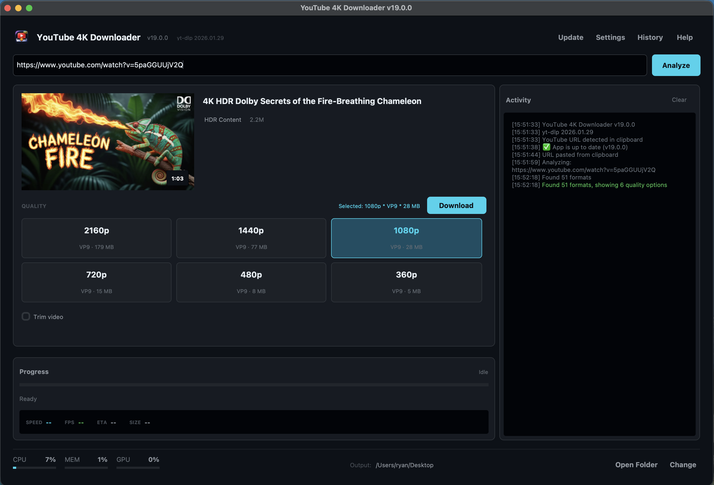
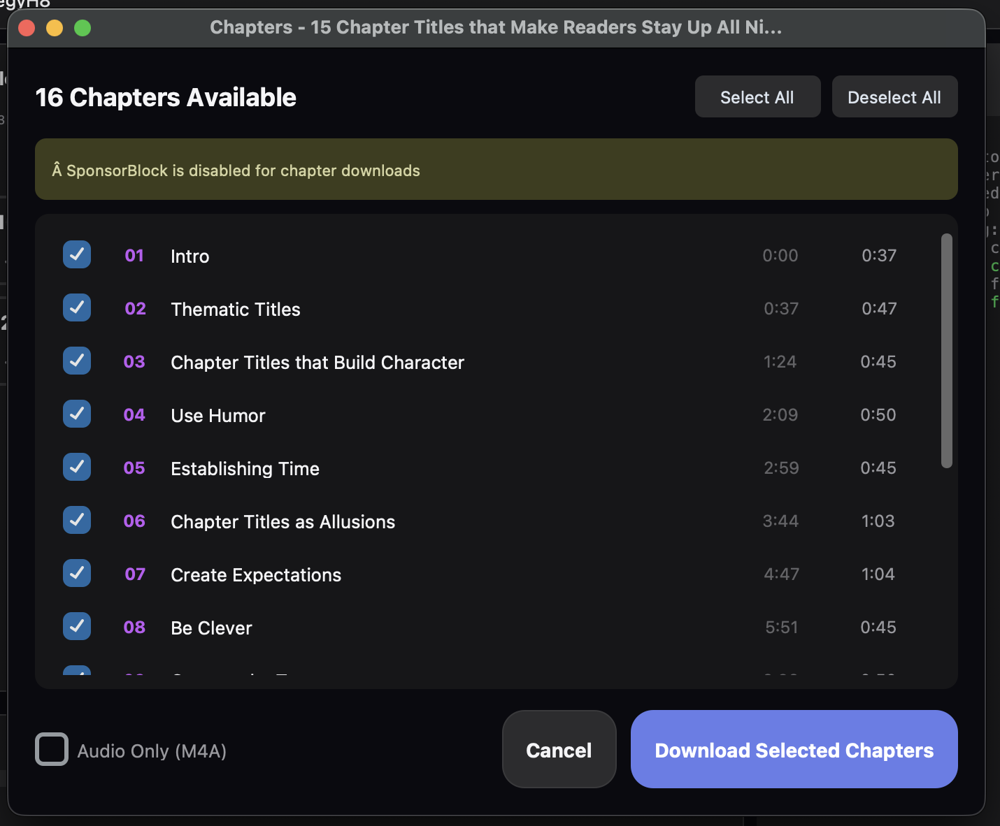
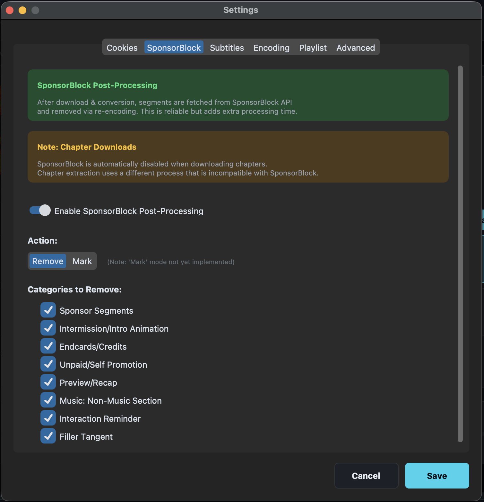
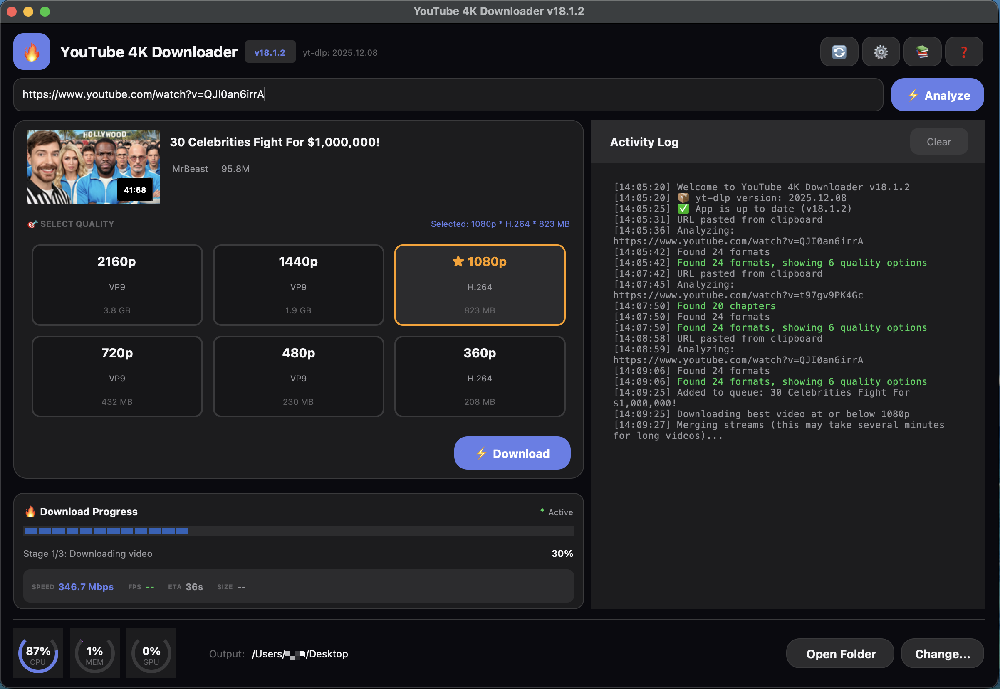

# YouTube 4K Downloader for macOS

A modern, fully self-contained YouTube video downloader with a beautiful dark mode interface. One of the only MacOS apps that can download 4K content directly from YouTube in native MacOS compatible format and remove all sponsor segments within the video. No dependencies required, No Ads, No Donation Request or Nags, No Telemetry & No "Calling Home" - just download and run!

## Screenshots

### Main Interface


### Chapter Downloads


### Settings


### Download Progress


## Features

- 🔄 **Auto-Update yt-dlp** - Keep yt-dlp current without re-downloading the app
- 🎬 **4K/1080p/720p Downloads** - Select your preferred quality
- 📚 **Chapter Downloads** - Split videos into separate files per chapter
- 🎨 **Modern Dark Mode UI** - Beautiful iOS-inspired interface with emojis
- 📦 **100% Self-Contained** - No Homebrew, no Python, no dependencies
- ⚡ **Fast Downloads** - Separate video+audio download with smart merging
- 🎵 **Audio Only Mode** - Extract audio as M4A or MP3
- 📋 **Playlist Support** - Download entire playlists
- ✂️ **SponsorBlock Integration** - Automatically remove sponsor segments
- 📝 **Subtitles** - Download and embed subtitles
- 🎬 **QuickTime Compatible** - H.264 + AAC encoding for native macOS playback
- 📊 **Progress Tracking** - Real-time speed, ETA, and progress display
- 🔔 **Notifications** - macOS notifications when downloads complete
- 📜 **Download History** - Browse and search past downloads

## NEW in v18.1.3: Major Reliability Update

### 🔄 Unified Retry System
YouTube aggressively rate-limits download requests. v18.1.3 introduces a **unified retry system** that makes downloads much more reliable:

- **6 total attempts** with progressive delays (5s, 10s, 15s, 20s, 25s)
- **Silent retries** - First 2 retries are quiet; only logs if problem persists
- **Visual feedback** - Shows "Waiting Xs for YouTube..." so app doesn't appear frozen
- Applies to **all downloads**: main videos, chapters, and playlists

### 🎬 True 4K Downloads Fixed
**Important bug fix!** Previous versions were downloading 1080p H.264 and upscaling to "fake 4K":

- Now correctly prioritizes **resolution over codec** for 4K content
- YouTube only offers H.264 up to 1080p; 4K requires VP9/AV1
- Resolution is verified after download to ensure true 4K quality

### 📊 Better Progress Feedback
- Chapter encoding shows **FPS, Speed, and ETA** during conversion
- Cleaner Activity Log - no more alarming ERROR messages during normal retries
- Filtered confusing yt-dlp warnings

### 🍎 macOS Improvements
- Fixed "Install ffmpeg" warning messages
- Clear explanation of CPU usage during 4K encoding:
  - VP9 decoding uses CPU (unavoidable - no hardware VP9 decoder on macOS)
  - H.264 encoding uses Apple's Media Engine (VideoToolbox)

## NEW in v18.1.2: Playlist Reliability Improvements

### Automatic Retry for Failed Videos
When downloading playlists, failed videos are now automatically retried once before marking as failed. This handles transient network issues and temporary YouTube rate limits.

### Detailed Error Reporting
The Activity Log now shows **specific reasons** for failed downloads:
- Age-restricted videos (requires authentication)
- Private videos
- Region-locked content  
- Copyright-removed videos
- Videos requiring login

## NEW in v18.1.1: YouTube Mix Playlist Handling

### Smart Mix Detection
YouTube Mix playlists (auto-generated "Radio" playlists based on a video) cannot be downloaded as playlists since YouTube doesn't expose the full list. The app now:
- Detects Mix playlists (URLs with `list=RD...`)
- Shows a helpful explanation in the Activity Log
- Automatically falls back to single-video mode
- Downloads the seed video without errors

## NEW in v18.1.0: Full Playlist Support

Download entire YouTube playlists with smart video selection!

### Smart URL Detection
- **Explicit playlist URLs** (`youtube.com/playlist?list=xxx`) automatically enable playlist mode
- **Video-in-playlist URLs** (`watch?v=xxx&list=yyy`) show a toggle to choose single video or full playlist
- The app intelligently detects your intent based on the URL type

### Playlist Selection Dialog
- See all videos in the playlist with titles, durations, and channels
- **Select All / Deselect All** buttons for quick selection
- Choose quality (Best/4K/1440p/1080p/720p/480p) for all videos
- **Audio-only mode** to extract audio from all selected videos

### Organized Downloads
Videos are saved to a folder named after the playlist:
```
Playlist Title/
├── 01 - First Video.mp4
├── 02 - Second Video.mp4
├── 03 - Third Video.mp4
└── ...
```

### How to use:
1. Paste a YouTube playlist URL
2. If it's a video-in-playlist URL, toggle "📋 Playlist" to enable playlist mode
3. Click **Analyze** to load all videos
4. Select which videos to download in the playlist dialog
5. Choose quality and click **Download**

### Playlist Settings
Configure defaults in Settings → Playlist:
- **Download all by default** - Pre-select all videos
- **Reverse order** - Download oldest first
- **Max videos** - Limit number of videos

## Auto-Update yt-dlp

**No more re-downloading the entire app when yt-dlp updates!**

YouTube frequently changes their API, which requires yt-dlp updates to keep working. Now you can update yt-dlp directly from within the app!

### How it works:
1. Click the 🔄 **Update** button in the header
2. The app checks GitHub for the latest yt-dlp release
3. If an update is available, click to download and install
4. The new version is active immediately - no restart required!

### Features:
- **One-click updates** - Update yt-dlp with a single click
- **Automatic check on launch** - Button turns orange when update available
- **User-writable location** - Updates stored in `~/Library/Application Support/`
- **No admin required** - No need to re-download or reinstall the app
- **Instant activation** - New version works immediately

## Chapter Downloads

Download YouTube videos split by their chapters! Perfect for:
- **Podcasts** - Download each topic as a separate file
- **Music compilations** - Extract individual songs
- **Tutorials** - Get specific sections you need
- **Long videos** - Download only the chapters you want

### How to use:
1. Analyze a YouTube video that has chapters
2. A purple **"🔖 Chapters"** button will appear
3. Select which chapters to download (or download all)
4. Choose **Audio Only** if you just want the audio
5. Click Download - each chapter becomes a separate file!

### Output Structure:
```
Video Title/
├── 01 - Introduction.mp4
├── 02 - Getting Started.mp4
├── 03 - Advanced Topics.mp4
└── ...
```

### Performance:
Chapter downloads are **10-50x faster** than previous methods! The app downloads and encodes the video once, then uses stream copy to split into chapters (no re-encoding per chapter).

## Installation

### Option 1: Download the App (Recommended)

1. Go to the [Releases](https://github.com/bytePatrol/YT-DLP-GUI-for-MacOS/releases) page
2. Download `YouTube.4K.Downloader.app.zip`
3. Unzip and drag to your **Applications** folder

### ⚠️ First Launch (Required Once)

macOS blocks apps from unidentified developers. Follow these steps on first launch:

1. **Double-click** the app to try opening it (it will be blocked - this is expected)
2. Open **System Settings** → **Privacy & Security**
3. Scroll down to find **"YouTube 4K Downloader" was blocked...**
4. Click **"Open Anyway"**
5. Enter your password if prompted
6. The app will now open, and future launches work normally

> **Note:** This is a standard macOS security feature. The app is safe - it's just not signed with an Apple Developer certificate ($99/year).

### Alternative: Terminal Command

If you prefer, you can also remove the quarantine flag via Terminal:

```bash
xattr -cr /Applications/YouTube\ 4K\ Downloader.app
```

Then double-click to open normally.

### Option 2: Run from Source

```bash
# Clone the repository
git clone https://github.com/bytePatrol/YT-DLP-GUI-for-MacOS.git
cd YT-DLP-GUI-for-MacOS

# Install dependencies
pip install customtkinter pillow requests yt-dlp psutil

# Run the app
python yt_dlp_gui_v18_1_3.py
```

## Usage

1. **Paste a YouTube URL** - Copy a YouTube link and it will auto-detect, or paste manually
2. **Click ⚡ Analyze** - View available formats and quality options
3. **Select Quality** - Choose from 4K, 1080p, 720p, etc.
4. **Click ⚡ Download** - Watch the progress with real-time stats
5. **For Chapters** - Click the purple "🔖 Chapters" button if available

### Keyboard Shortcuts

| Shortcut | Action |
|----------|--------|
| `⌘V` | Paste URL from clipboard |
| `⌘Return` | Start download |
| `Return` | Analyze URL |

## Settings

Access settings via the ⚙️ **Settings** button to configure:

- **SponsorBlock** - Enable/disable, select categories to remove
- **Subtitles** - Languages, auto-generated, embedding
- **Encoding** - GPU/CPU, preset, bitrate modes
- **Trim** - Set start/end times
- **Playlist** - Download options for playlists

## System Requirements

- macOS 10.13 (High Sierra) or later
- Apple Silicon (M1/M2/M3/M4) or Intel Mac
- ~200MB disk space

## Tech Stack

- **Python 3** - Core application
- **CustomTkinter** - Modern UI framework
- **yt-dlp** - Video downloading engine (bundled, auto-updatable)
- **ffmpeg** - Video processing and encoding (bundled)
- **deno** - JavaScript runtime for yt-dlp (bundled)
- **py2app** - macOS app bundling

## Building from Source

```bash
# Clone and enter directory
git clone https://github.com/bytePatrol/YT-DLP-GUI-for-MacOS.git
cd YT-DLP-GUI-for-MacOS

# Build using the build script (recommended)
./build_app.sh

# Or manually:
pip install py2app customtkinter pillow requests yt-dlp psutil
python setup.py py2app
```

### Build Note for Python 3.14

If you encounter tkinter errors during build, you may need to use Python 3.13:

```bash
# Create venv with Python 3.13 specifically
/opt/homebrew/opt/python@3.13/bin/python3.13 -m venv venv
source venv/bin/activate
pip install py2app customtkinter pillow requests yt-dlp psutil
./build_app.sh
```

## Troubleshooting

### "App is damaged and can't be opened"
This is a Gatekeeper issue. Run in Terminal:
```bash
xattr -cr /Applications/YouTube\ 4K\ Downloader.app
```

### "App can't be opened because it is from an unidentified developer"
Right-click the app → Select "Open" → Click "Open" in the dialog.

### App launches but immediately crashes
Run this in Terminal to see the error:
```bash
/Applications/YouTube\ 4K\ Downloader.app/Contents/MacOS/YouTube\ 4K\ Downloader
```

### "Age-restricted video" error
The app will show you instructions. You need to:
1. Export cookies from your browser while logged into YouTube
2. Use yt-dlp from command line with: `yt-dlp --cookies-from-browser chrome URL`

### Downloads fail repeatedly
- **Try updating yt-dlp:** Click the 🔄 Update button in the header
- YouTube frequently changes their API - an updated yt-dlp usually fixes issues
- v18.1.3 has improved retry logic that handles most rate limiting automatically

### 4K downloads look like 1080p upscaled
- This was a bug in versions before v18.1.3 - please update!
- v18.1.3 correctly downloads true 4K VP9/AV1 content

### Downloads fail or no formats shown
- Make sure you have an internet connection
- **Try updating yt-dlp:** Click the 🔄 Update button in the header
- Some videos may be region-locked or private

### Chapter downloads not showing
- Not all YouTube videos have chapters defined
- Chapters must be set by the video creator
- Try a video known to have chapters (like podcasts or music compilations)

### yt-dlp update button not working
- Check your internet connection
- The app downloads from GitHub releases - ensure github.com is accessible
- Updates are stored in `~/Library/Application Support/YouTube 4K Downloader/`

## Contributing

Contributions are welcome! Please feel free to submit a Pull Request.

## License

MIT License - see [LICENSE](LICENSE) for details.

## Acknowledgments

- [yt-dlp](https://github.com/yt-dlp/yt-dlp) - The amazing video download library
- [CustomTkinter](https://github.com/TomSchimansky/CustomTkinter) - Modern UI framework
- [SponsorBlock](https://sponsor.ajay.app/) - Community-driven sponsor segment database

## Author

**bytePatrol**

---

⭐ If you find this useful, please star the repository!
