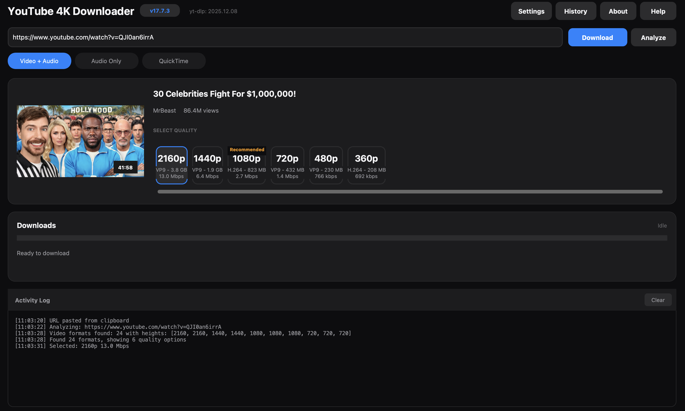

# YouTube 4K Downloader for macOS

A modern, fully self-contained YouTube video downloader with a beautiful dark mode interface. No dependencies required - just download and run!



## Features

- **🎬 4K/1080p/720p Downloads** - Select your preferred quality
- **🎨 Modern Dark Mode UI** - Beautiful iOS-inspired interface
- **📦 100% Self-Contained** - No Homebrew, no Python, no dependencies
- **⚡ Fast Downloads** - Separate video+audio download with smart merging
- **🎵 Audio Only Mode** - Extract audio as M4A or MP3
- **📋 Playlist Support** - Download entire playlists
- **✂️ SponsorBlock Integration** - Automatically remove sponsor segments
- **📝 Subtitles** - Download and embed subtitles
- **🍎 QuickTime Compatible** - H.264 + AAC encoding for native macOS playback
- **📊 Progress Tracking** - Real-time speed, ETA, and progress display
- **🔔 Notifications** - macOS notifications when downloads complete
- **📜 Download History** - Browse and search past downloads

## Installation

### Option 1: Download the App (Recommended)

1. Go to the [Releases](https://github.com/bytePatrol/YT-DLP-GUI-for-MacOS/releases) page
2. Download `YouTube.4K.Downloader.app.zip`
3. Unzip and drag to your Applications folder
4. Right-click and select "Open" (first time only, to bypass Gatekeeper)

### Option 2: Run from Source

```bash
# Clone the repository
git clone https://github.com/bytePatrol/YT-DLP-GUI-for-MacOS.git
cd YT-DLP-GUI-for-MacOS

# Install dependencies
pip install customtkinter pillow requests yt-dlp

# Run the app
python yt_dlp_gui_v17.7.3.py
```

## Usage

1. **Paste a YouTube URL** - Copy a YouTube link and it will auto-detect, or paste manually
2. **Click Analyze** - View available formats and quality options
3. **Select Quality** - Choose from 4K, 1080p, 720p, etc.
4. **Click Download** - Watch the progress with real-time stats

### Keyboard Shortcuts

| Shortcut | Action |
|----------|--------|
| `⌘V` | Paste URL from clipboard |
| `⌘Return` | Start download |
| `Return` | Analyze URL |

## Settings

Access settings via the **Settings** button to configure:

- **SponsorBlock** - Enable/disable, select categories to remove
- **Subtitles** - Languages, auto-generated, embedding
- **Encoding** - GPU/CPU, preset, bitrate modes
- **Trim** - Set start/end times
- **Playlist** - Download options for playlists

## System Requirements

- macOS 10.13 (High Sierra) or later
- Apple Silicon (M1/M2/M3) or Intel Mac
- ~200MB disk space

## Tech Stack

- **Python 3** - Core application
- **CustomTkinter** - Modern UI framework
- **yt-dlp** - Video downloading engine
- **ffmpeg** - Video processing and encoding
- **py2app** - macOS app bundling

## Building from Source

```bash
# Install build dependencies
pip install py2app customtkinter pillow requests yt-dlp

# Build the app
python setup.py py2app

# The app will be in dist/YouTube 4K Downloader.app
```

## Contributing

Contributions are welcome! Please feel free to submit a Pull Request.

## License

MIT License - see [LICENSE](LICENSE) for details.

## Acknowledgments

- [yt-dlp](https://github.com/yt-dlp/yt-dlp) - The amazing video download library
- [CustomTkinter](https://github.com/TomSchimansky/CustomTkinter) - Modern UI framework
- [SponsorBlock](https://sponsor.ajay.app/) - Community-driven sponsor segment database

## Author

**bytePatrol**

---

⭐ If you find this useful, please star the repository!
