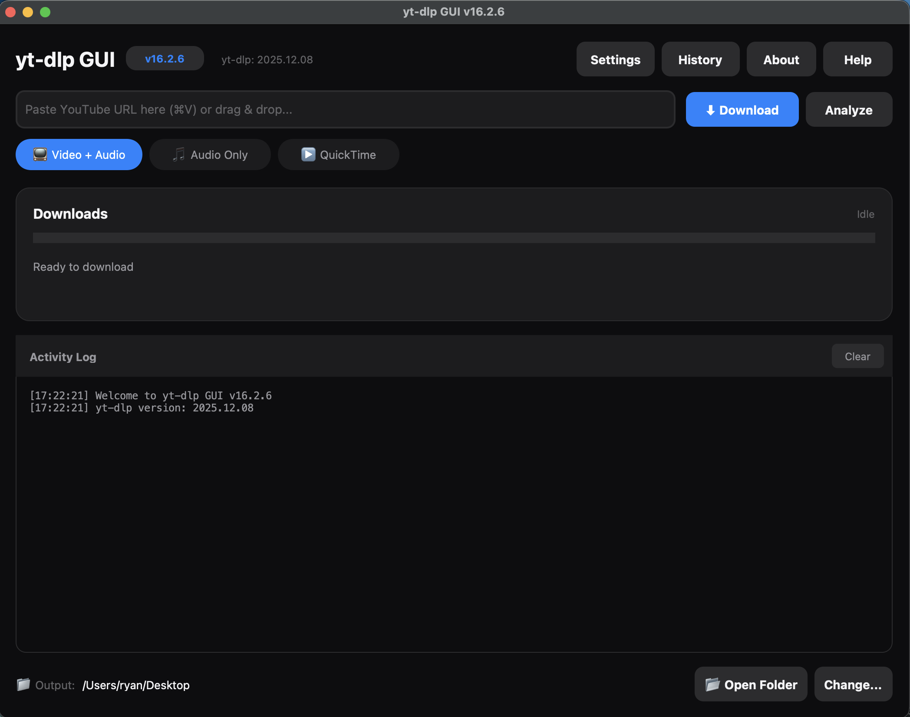
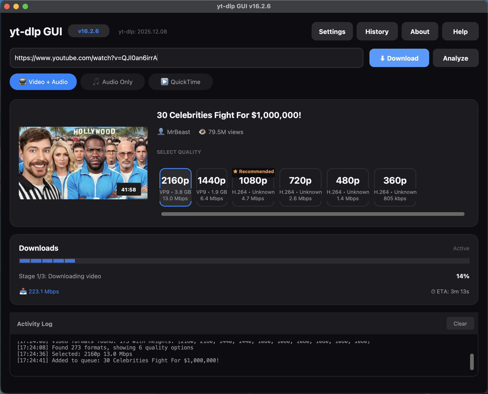

# YT-DLP GUI for MacOS

<div align="center">


**A beautiful, native MacOS application for downloading videos with yt-dlp**

[](https://opensource.org/licenses/MIT)
[](https://www.apple.com/macos/)
[](https://github.com/bytePatrol/YT-DLP-GUI-for-MacOS/releases)

[Download Latest Release](https://github.com/bytePatrol/YT-DLP-GUI-for-MacOS/releases/latest) • [Report Bug](https://github.com/bytePatrol/YT-DLP-GUI-for-MacOS/issues) • [Request Feature](https://github.com/bytePatrol/YT-DLP-GUI-for-MacOS/issues)

</div>

---

## 📸 Screenshots

<div align="center">

### Main Interface


### Download in Progress


### Settings Panel


</div>

---

## ✨ Features

- 🎨 **Native MacOS Design** - Clean, intuitive interface that feels right at home on your Mac
- 🎬 **Multiple Quality Options** - Choose from Best, 1080p, 720p, 480p, or Audio-only formats
- 📁 **Custom Save Locations** - Save downloads wherever you want with an easy folder picker
- 📝 **Playlist Support** - Download entire playlists or individual videos
- ⚡ **Real-time Progress** - Watch download progress with detailed status updates
- 🎵 **Audio Extraction** - Extract audio in M4A format with excellent quality
- 🔄 **Queue Management** - Queue multiple downloads and process them sequentially
- 💾 **Smart Defaults** - Automatically saves to your Downloads folder
- 🎯 **Format Selection** - Intelligent format selection for best quality and compatibility

---

## 🚀 Quick Start

### Download Pre-built App (Recommended)

1. **Download** the latest release from the [Releases page](https://github.com/bytePatrol/YT-DLP-GUI-for-MacOS/releases/latest)
2. **Extract** the downloaded file if it's in a `.zip` or `.dmg` format
3. **Move** `YT-DLP GUI.app` to your Applications folder
4. **Launch** the app (you may need to right-click and select "Open" the first time due to MacOS security)

### First Launch

On first launch, you might see a security warning. To open the app:

1. Right-click (or Control-click) the app icon
2. Select "Open" from the menu
3. Click "Open" in the dialog that appears
4. The app will now launch normally

---

## 📖 Usage Guide

### Basic Download

1. **Copy** a video URL from your browser
2. **Paste** the URL into the input field
3. **Select** your desired quality from the dropdown
4. **(Optional)** Click "Choose Save Location" to select a custom folder
5. **Click** "Download" and watch the magic happen!

### Quality Options

| Quality | Description | Best For |
|---------|-------------|----------|
| **Best** | Highest quality available (may include 4K) | Large screens, archival |
| **1080p** | Full HD quality | Most use cases |
| **720p** | HD quality, smaller files | Balanced quality/size |
| **480p** | Standard definition | Quick downloads, mobile |
| **Audio Only** | M4A audio format | Music, podcasts |

### Playlist Downloads

- The app automatically detects playlists
- You'll see progress for each video in the playlist
- All videos download to the same location
- Failed videos won't stop the entire playlist

### Download Management

- **Queue Multiple Downloads**: Paste new URLs while downloads are in progress
- **Cancel Downloads**: Use the "Cancel" button to stop the current download
- **Status Updates**: Watch real-time progress, speed, and ETA
- **Error Handling**: Clear error messages if something goes wrong

---

## 🛠️ Building from Source

### Prerequisites

```bash
# Install Homebrew (if not already installed)
/bin/bash -c "$(curl -fsSL https://raw.githubusercontent.com/Homebrew/install/HEAD/install.sh)"

# Install Python 3
brew install python@3.11

# Install required packages
pip3 install customtkinter Pillow yt-dlp
```

### Build the App

```bash
# Clone the repository
git clone https://github.com/bytePatrol/YT-DLP-GUI-for-MacOS.git
cd YT-DLP-GUI-for-MacOS

# Run the build script
python3 yt_dlp_gui.py --build
```

The built app will be in the `dist` folder.

### Run from Source

```bash
# Simply run the Python script
python3 yt_dlp_gui.py
```

---

## ⚙️ Technical Details

### Technologies Used

- **Python 3.11+** - Core application logic
- **CustomTkinter** - Modern UI framework for native look and feel
- **yt-dlp** - Powerful video download engine
- **Pillow** - Image processing for icons and UI elements
- **py2app** - MacOS application bundling

### Architecture

The app is structured as a standalone MacOS application with:
- Embedded Python interpreter
- Bundled yt-dlp binary
- Self-contained dependencies
- No external Python installation required

---

## ⚠️ Important Notice: yt-dlp Updates

**This application includes a specific version of yt-dlp bundled at build time.**

### What This Means

- ✅ The app works immediately without any setup
- ✅ No command-line tools or technical knowledge required
- ⚠️ **The bundled yt-dlp version will NOT auto-update**
- ⚠️ If video sites change their formats, you may need an updated version

### When to Update

You should download a new version of this app when:
- Videos fail to download from sites that previously worked
- You see messages about unsupported formats
- New features are added to yt-dlp that you want to use
- A new release is announced in this repository

### Staying Updated

- ⭐ **Star this repository** to get notified of new releases
- 👀 **Watch** the repository for release announcements
- 🔔 Check the [Releases page](https://github.com/bytePatrol/YT-DLP-GUI-for-MacOS/releases) periodically
- 📱 Enable GitHub notifications for this project

> **Note**: Because yt-dlp is bundled within the app, it cannot be updated independently. This trade-off provides simplicity and ease of use at the cost of requiring manual app updates for yt-dlp improvements.

---

## 🐛 Troubleshooting

### App Won't Open

**Problem**: "App can't be opened because it is from an unidentified developer"

**Solution**: 
1. Right-click the app and select "Open"
2. Or go to System Preferences → Security & Privacy → Allow the app

### Download Fails

**Problem**: Video fails to download

**Solution**:
- Check your internet connection
- Verify the URL is correct and the video is publicly available
- Try a different quality setting
- Check the [Releases page](https://github.com/bytePatrol/YT-DLP-GUI-for-MacOS/releases) for an updated version

### Slow Downloads

**Problem**: Downloads are slower than expected

**Solution**:
- Check your internet speed
- Some video hosting sites have rate limits
- Try downloading during off-peak hours
- Close other bandwidth-intensive applications

### Permission Errors

**Problem**: Can't save to selected location

**Solution**:
- Ensure you have write permissions to the destination folder
- Try selecting a different save location
- Check your disk space

---

## 🤝 Contributing

Contributions are welcome! Here's how you can help:

1. **Fork** the repository
2. **Create** a feature branch (`git checkout -b feature/AmazingFeature`)
3. **Commit** your changes (`git commit -m 'Add some AmazingFeature'`)
4. **Push** to the branch (`git push origin feature/AmazingFeature`)
5. **Open** a Pull Request

### Ideas for Contributions

- 🎨 UI/UX improvements
- 🌐 Additional format support
- 📱 Download queue enhancements
- 🔧 Bug fixes and optimizations
- 📖 Documentation improvements

---

## 📋 Roadmap

- [ ] Dark mode support
- [ ] Subtitle download options
- [ ] Download history
- [ ] Batch URL import
- [ ] Custom format strings
- [ ] Speed limiter
- [ ] Notification system
- [ ] Auto-update checker (notify when new app version available)

---

## 📄 License

This project is licensed under the MIT License - see the [LICENSE](LICENSE) file for details.

### Third-Party Licenses

- **yt-dlp**: [Unlicense](https://github.com/yt-dlp/yt-dlp/blob/master/LICENSE)
- **CustomTkinter**: [MIT License](https://github.com/TomSchimansky/CustomTkinter/blob/master/LICENSE)
- **Pillow**: [HPND License](https://github.com/python-pillow/Pillow/blob/main/LICENSE)

---

## 🙏 Acknowledgments

- **[yt-dlp](https://github.com/yt-dlp/yt-dlp)** - The powerful download engine that makes this app possible
- **[CustomTkinter](https://github.com/TomSchimansky/CustomTkinter)** - For the beautiful, modern UI framework
- **The MacOS community** - For feedback and support

---

## 💬 Support

- 📧 **Email**: [Create an issue](https://github.com/bytePatrol/YT-DLP-GUI-for-MacOS/issues)
- 🐛 **Bug Reports**: [Issue Tracker](https://github.com/bytePatrol/YT-DLP-GUI-for-MacOS/issues)
- 💡 **Feature Requests**: [Issue Tracker](https://github.com/bytePatrol/YT-DLP-GUI-for-MacOS/issues)

---

<div align="center">

**Made with ❤️ for the MacOS community**

⭐ If you find this project useful, please consider giving it a star!

[Back to Top](#yt-dlp-gui-for-macos)

</div>
